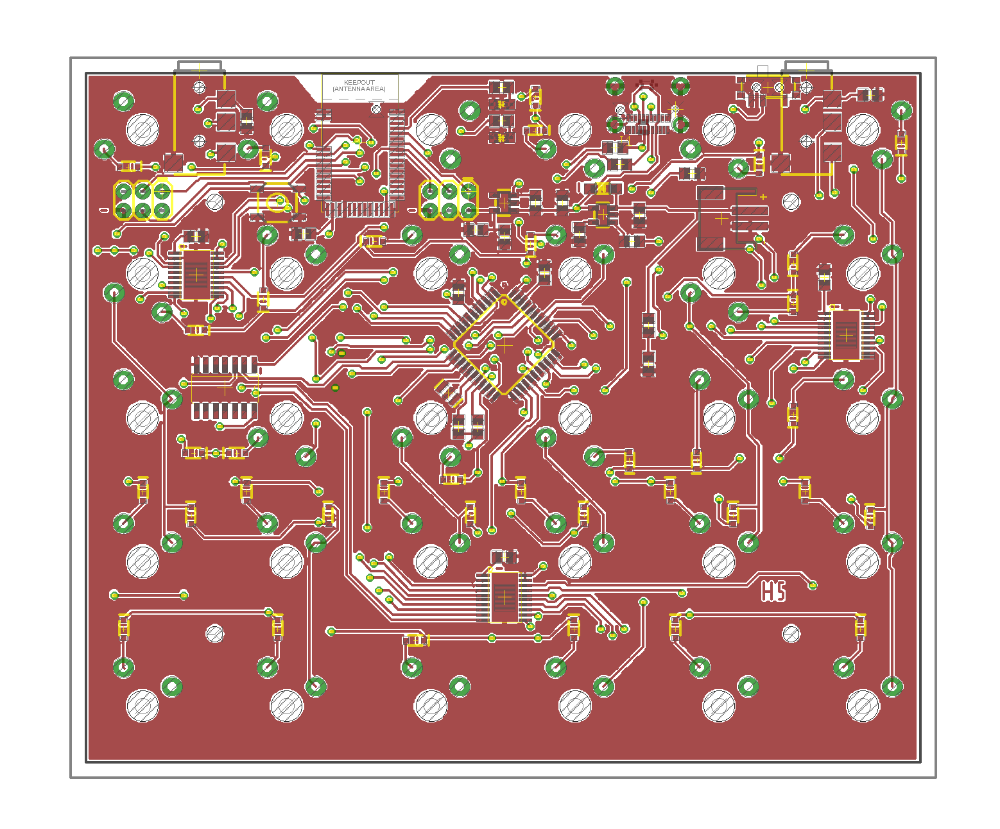

This is a PCB for a bluetooth split 12x5 ortholinear keyboard:
* Based on Adafruit's 32u4 
[Feather](https://github.com/adafruit/Adafruit-Feather-32u4-Bluefruit-LE-PCB)
beard. 
* Wireless (BLE) and wired (USB-C) mode.
* LED backlight.
* There are two 6x2 halves with identical PCBs. The _master_ half runs the QMK
firmware, and handles USB, BLE and battery charging. The _slave_ half is
responsible for only reporting its state to _master_ over I2C.
* Extra TRRS jack on the _slave_ half, making it possible to chain other I2C 
peripherals (think pedals).
* The board is flashed with the QMK firmware -- see my
[fork](https://github.com/hristost/qmk_firmware/tree/hristost_merp/keyboards/merp)
.

## Bluetooth
The PCB uses the Raytac MDBT-40 module for bluetooth. QMK has built-in support
for that module when flashed with Adafruit's 
[SPIFriend](https://github.com/adafruit/Adafruit_BluefruitLE_Firmware) firmware.

Since the Bluetooth module connects to the SPI bus, remember to flash the CPU
_before_ the Bluetooth module. Otherwise, the SPI bus will be taken and ICSP 
won't work.

## LED backlight
This keyboard has LED backlight, however:
* The drivers I used (TLC59711) draw quite some current on stand-by that makes
them unsuitable for battery-powered devices. I chose them because I already had
some left over from a previous project.
* Since the keyboard is "borderless", some switches have been rotated so that
components can fit between them. As a result, the backlight is uneven and would
not be suitable for actual backlit keys.
* The two halves operate backlight independently as of now, so any advanced
animation would have to utilise the I2C bus.
    
## Known issues:
I designed this keyboard just for fun and as such it has some shortcomings:
* The BLE module is somewhat hard to come by -- Mouser has it but it was out of
stock the few times I checked. Moreover, the Adafruit firmware for it
is closed source and you can only download binary images.
* Power management could be a lot better. Moreover, the keyboeard does not 
really have a stand-by state, instead, there is a switch that simply cuts all
power from the battery.
* The BLE module has enough processing
power to handle everything the CPU does now, but can't quite run QMK as of now.
(Another reason for sticking with _32u4_ is that it can easily be programmed
over USB)
    

